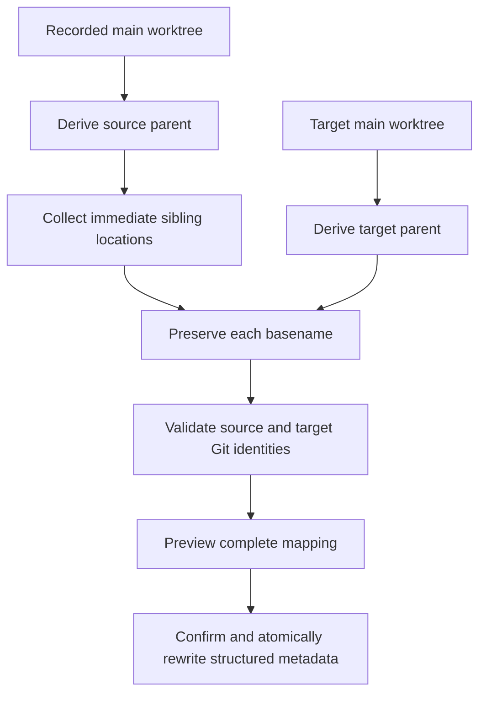
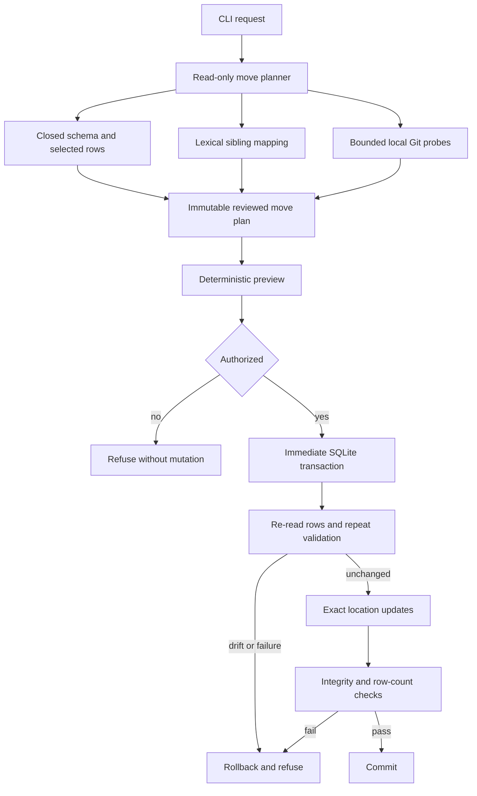

# Sibling Project Move - Plan

## Goal Capsule

- **Objective:** Add a fail-closed metadata move that rebases one project's flat family of sibling Git checkouts from one parent directory to another after the operator copies them.
- **Authority:** The Product Contract defines behavior and scope; `AGENTS.md` defines repository safety and verification policy; the Planning Contract defines implementation structure without changing either.
- **Execution profile:** Standard-depth Python feature with test-first proof around read-only planning before mutation coverage.
- **Stop conditions:** Stop if implementation requires changing the Product Contract, cannot identify the complete supported location set, cannot establish Git correspondence without broadening the accepted contract, or cannot keep previewed and committed state bound together.
- **Tail ownership:** The implementing workflow owns focused tests, the full child suite, compile checks, documentation synchronization, and one coherent child-repository changeset.
- **Open blockers:** None.

---

## Product Contract

### Summary

`opencode-db mv` will support a `sibling` method that validates and previews a complete parent-directory substitution before atomically rewriting structured project location metadata.
The operator remains responsible for copying and later removing filesystem directories.

### Problem Frame

OpenCode can associate one project with a main worktree, additional project directories and sandboxes, workspaces, and sessions created from different checkout directories.
When an operator relocates a flat family of related checkouts, those structured locations continue to reference the old parent even though the Git project identity is unchanged.
Editing only the main worktree leaves the project internally inconsistent, while unrestricted path replacement risks changing historical content or partially relocating a project with a more complex layout.

### Key Decisions

- **Metadata-only movement.** `mv` validates an operator-created copy and rewrites database metadata; it never moves filesystem content. (session-settled: user-directed — chosen over command-owned filesystem movement: the operator owns filesystem placement and cleanup.)
- **Method-based interface.** `--method sibling` is the default and initially the only accepted method, leaving room for separately specified move topologies later.
- **Strict sibling eligibility.** Every structured location must be an immediate child of one source parent. (session-settled: user-directed — chosen over explicit mappings or selective prefix rewriting: a sibling move must be complete and unambiguous.)
- **Explicit project identity.** The operator selects the project by project ID. (session-settled: user-directed — chosen over worktree-path selection: the project ID remains stable across path relocation.)
- **Source and target comparison.** Both directory families must remain present through validation. (session-settled: user-directed — chosen over allowing missing sources: corresponding Git identities can be compared before mutation.)
- **Interactive confirmation.** The default flow previews all mappings and requires a `y` response; noninteractive mutation requires `--yes`. (session-settled: user-directed — chosen over an immediate transaction or unconditional stdin wait: operators see the complete change while automation remains explicit.)
- **Opt-in progress.** `--progress` adds phase transitions and progress bars on stderr without changing default output. Redirected progress is line-based rather than animated. (session-settled: user-directed — chosen over always-on or stdout progress: scripts retain deterministic results and logs avoid terminal control behavior.)
- **Structured metadata only.** Historical messages, tool calls, command output, prompts, and other free-form content remain byte-for-byte outside the rewrite. (session-settled: user-directed — chosen over rewriting structured or free-form history: historical records describe events at their original locations.)

### Requirements

**Command contract**

- R1. `opencode-db mv` must require `--project-id ID` and `--target-project-dir ABSOLUTE_TARGET_PROJECT_DIR`.
- R2. `--method` must default to `sibling`, accept `sibling` as its only initial value, and reject every unknown value without changing the database.
- R3. The target main worktree must have the same basename as the project's recorded main worktree.
- R4. The command must support the same explicit or bounded default database selection available to other `opencode-db` project commands.

**Sibling eligibility and validation**

- R5. The sibling method must collect every distinct structured project location represented by the project worktree, project directories, sandboxes, sessions, and workspaces.
- R6. Every collected source location must be an immediate child of the recorded main worktree's parent directory; nested and external locations make the project ineligible.
- R7. Each target location must be derived by preserving the source basename beneath the target main worktree's parent directory.
- R8. Every source and derived target location must exist before the command offers mutation; a refusal must identify whether the source or target is missing, its structured metadata categories, and its quoted ASCII-escaped absolute path.
- R9. Each source and target pair must represent the corresponding checkout in the same Git project family.
- R10. Any missing location, same-parent or identity mapping, layout violation, duplicate or conflicting mapping, or Git identity mismatch must reject the whole operation with an actionable diagnostic and no database change. The diagnostic must name the failed rule, the affected quoted path pair or metadata categories, and the specific expected-versus-observed difference; Git refusals must distinguish project identity, attached-versus-detached state, branch, HEAD, non-repository, unavailable Git, malformed output, output cap, and timeout without exposing credentials.

**Preview and confirmation**

- R11. Before mutation, the command must present the complete source-to-target path mapping and identify every structured metadata category affected by it.
- R12. In an interactive terminal, only a `y` response may authorize mutation; `n`, end-of-input, or any other response must leave the database unchanged.
- R13. Without an interactive terminal, mutation must fail unless `--yes` was supplied explicitly.
- R14. `--yes` must bypass only the prompt, not eligibility checks, target validation, or the preview output.

**Mutation boundary**

- R15. The accepted move must rewrite all affected structured locations as one all-or-nothing database change.
- R16. The rewrite must preserve each directory basename and alter only the shared parent component.
- R17. The command must not rewrite path-like text in historical messages, tool records, prompts, output, metadata, or other free-form content.
- R18. The command must not create, copy, move, repair, rename, or remove filesystem entries.

**Progress reporting**

- R19. `--progress` must emit phase transitions and truthful completed/total progress on stderr only; terminal stderr may redraw a progress bar, redirected stderr must use bounded line-based updates, and omitting the option must emit no progress output.

The sibling mapping has this shape:

### Key Flows

- F1. Interactive sibling move
  - **Trigger:** The operator selects a project ID and target main worktree with the default or explicit `sibling` method.
  - **Steps:** The command collects structured locations, validates the flat source and target families, prints the complete mapping, optionally reports progress on stderr, and prompts for `y/n`.
  - **Outcome:** A `y` response atomically rebases all structured locations; every other response leaves the database unchanged.
  - **Covered by:** R1-R12, R15-R19.
- F2. Noninteractive sibling move
  - **Trigger:** The operator invokes the same move without an interactive terminal.
  - **Steps:** The command performs the same collection, validation, preview, and optional stderr progress behavior and checks for explicit `--yes` authorization.
  - **Outcome:** The command mutates only when `--yes` is present and all validations pass.
  - **Covered by:** R1-R11, R13-R19.
- F3. Ineligible sibling move
  - **Trigger:** Collection or validation finds a nested or external location, a missing path, an invalid target basename, or a Git identity mismatch.
  - **Steps:** The command reports the blocking location and reason before confirmation.
  - **Outcome:** No structured location is rewritten.
  - **Covered by:** R3, R5-R10.

### Acceptance Examples

- AE1. **Covers R1-R12, R15-R18.** Given a project whose main worktree, project directories, sandboxes, session directories, and workspace directories are immediate siblings, and given matching copied Git checkouts under a new parent, when the operator confirms with `y`, then every structured location is rebased in one database change and no filesystem entry or historical content is modified.
- AE2. **Covers R2.** Given any `--method` value other than `sibling`, when `mv` runs, then it reports the unsupported method and makes no database change.
- AE3. **Covers R3.** Given a recorded main worktree named `mkchad`, when the target main worktree has a different basename, then validation fails before confirmation.
- AE4. **Covers R6.** Given a session directory nested beneath one checkout, when the sibling method collects project locations, then the project is rejected as ineligible rather than rewriting that nested path.
- AE5. **Covers R5-R6.** Given a workspace directory outside the shared source parent, when the sibling method collects project locations, then the entire move is rejected.
- AE6. **Covers R8-R10.** Given one missing target sibling or a target with a different Git identity, when validation runs, then the diagnostic identifies the missing target's categories and quoted path or the exact Git mismatch dimension with safely rendered expected/observed evidence, and no preview confirmation is offered.
- AE7. **Covers R11-R12.** Given an eligible interactive move, when the operator responds with `n` or anything other than `y`, then the database remains unchanged after displaying the complete mapping.
- AE8. **Covers R13-R14.** Given an eligible noninteractive move without `--yes`, when the command runs, then it displays the mapping and fails without mutation; with `--yes`, the same validations still apply before mutation.
- AE9. **Covers R15-R17.** Given historical records containing old absolute paths, when an eligible move succeeds, then structured location fields use the new parent while the historical records retain their original content.
- AE10. **Covers R19.** Given the same eligible move with and without `--progress`, when it runs, then only the opted-in invocation emits phase and determinate progress information on stderr; terminal stderr may redraw one bar while redirected stderr receives bounded newline-delimited updates, and stdout plus mutation behavior remain identical.

### Scope Boundaries

- Additional move methods are deferred for separate requirements work.
- Filesystem movement, copying, repair, and cleanup remain operator responsibilities.
- Directory inode identity, ownership, permission, and symlink analysis are outside the move contract.
- Historical and free-form path rewriting is excluded.
- Partial moves, selective rewrites, nested layouts, external workspace layouts, and operator-supplied path mappings are excluded from the `sibling` method.

### Dependencies and Assumptions

- The operator arranges OpenCode shutdown and concurrent-use safety before mutating its database.
- The selected database exposes the supported project, directory, session, sandbox, and workspace metadata needed to determine the complete structured location set.
- Source and target Git metadata is valid enough to establish corresponding project identity before the old copies are removed.

---

## Planning Contract

### Product Contract Preservation

Product Contract changed during document review: the Opt-in progress decision, R1 selector names, R8/R10 actionable refusal details, R10 no-op rejection, R19 progress behavior, F1-F2 progress steps, and AE10 terminal/detached progress coverage were added at the user's direction. All other Product Contract text and IDs are unchanged.

### Key Technical Decisions

- **Use a dedicated move domain with an immutable reviewed plan.** Read-only discovery, validation, path mapping, and Git evidence belong in a new move module; the CLI only parses, renders, confirms, and invokes mutation. The CLI may depend on the move domain, but the move domain must not depend on the CLI or import private helpers from inspection, transfer, or cleanup modules. Nested reviewed state uses immutable values so callers cannot alter mappings, row evidence, schema evidence, or Git evidence after preview. (session-settled: user-approved — chosen over distributing move behavior across existing inspection, transfer, and CLI code: the confirmed synthesis keeps adjacent refactoring out while giving the mutation one guarded boundary.)
- **Recognize a closed current location schema.** The move requires the known project worktree and sandbox fields plus project-directory, session-directory, and nullable workspace-directory records for the selected project. Its schema fingerprint covers required storage types and nullability, primary-key order, generated columns, unique indexes involving rewritten fields, outbound and inbound foreign keys, and triggers on affected tables. Unsupported triggers, generated location fields, inbound references to rewritten keys, unfamiliar constraints, missing required schema, malformed sandbox JSON, ambiguous project rows, and unknown project-scoped directory-bearing schema are safety refusals rather than partial support. The same fingerprint must match at application time. This extends the fail-closed schema and trigger patterns in `src/opencode_db/inspect.py` and `src/opencode_db/transfer.py`.
- **Use lexical sibling mapping for project directories.** Eligibility and target derivation operate on the absolute path strings recorded in SQLite and supplied on the command line: every non-null location must have exactly the main worktree's parent, and its basename is preserved beneath the target parent. The move checks directory existence but does not canonicalize aliases or add inode, ownership, permission, or symlink policy. (session-settled: user-directed — chosen over descendant rebasing and directory-security analysis: `sibling` is intentionally a flat topology method with those filesystem checks outside scope.)
- **Prove Git identity and checkout state locally.** Each source-target pair must be a Git worktree root with the same normalized project identity, branch-versus-detached state, and HEAD commit. Project identity follows the current OpenCode shape: compare normalized non-file origin identity when both repositories expose one, otherwise compare root-commit identity when both omit it; mixed or ambiguous evidence refuses. Git probes use bounded, no-shell, no-stdin subprocesses and never contact a remote. (session-settled: user-directed — chosen over project identity alone or identity plus HEAD only: each copied target must correspond to the exact source checkout state.)
- **Separate preview from an exact mutation boundary.** Planning starts one explicit read transaction before schema, integrity, project, or related-row queries and captures one coherent committed snapshot without using SQLite immutable mode. After authorization, application opens the same database non-creating and writable, enables and verifies foreign-key enforcement, acquires an immediate transaction, and invokes the same connection-scoped collector used by planning. The complete reviewed snapshot, schema fingerprint, filesystem evidence, and Git evidence must still match before any update; any drift invalidates the preview and rolls back. This follows the transaction and integrity patterns in `src/opencode_db/transfer.py` while strengthening their ordering for a reviewed mutation.
- **Update only known location fields.** Application changes the selected project's worktree and sandbox array, its project-directory rows, its session directories, and its non-null workspace directories. A project-directory change is a logical composite-key transition: each original key and unchanged payload must exist exactly once, each target key must be vacant, and the selected-project row count and payload must remain unchanged after transition. The move leaves timestamps, relative session paths, opaque metadata, transcript tables, and every unrelated project untouched; expected row counts plus pre- and post-update integrity and foreign-key checks must agree before commit. (session-settled: user-directed — chosen over structured or free-form history rewriting: historical records continue to describe their original paths.)
- **Keep `mv` human-readable and explicitly interactive.** The command uses `--db`, not the cleanup-only `--database`, and has no `--json` mode. It always writes a deterministic mapping preview to stdout; when `--yes` is absent, both stdin and stdout must be terminals and only an exact lowercase `y` response after line-ending removal authorizes application. Cancellation and detached-input refusal use the safety-precondition exit class, while bounded Git/SQLite execution failures use the operational-failure class. (session-settled: user-directed — chosen over immediate mutation or unconditional stdin reads: the default is go/no-go review and automation must opt in with `--yes`.)
- **Keep progress opt-in and separate from results.** `--progress` emits phase transitions and truthful completed/total progress on stderr only. Terminal stderr may redraw one ASCII progress bar; redirected stderr receives bounded newline-delimited updates with no carriage-return animation. Phases without a stable total report transitions only rather than inventing percentages. (session-settled: user-directed — chosen over always-on progress or stdout progress: default stdout remains deterministic and redirected logs remain readable.)
- **Limit integration changes to the new command contract.** Existing cleanup, inspection, and transfer behavior remains intact except for top-level dispatch, help, shared exit classification, and documentation statements that currently claim no command prompts. No general parser, database-helper, or output-schema consolidation is part of this work.

### High-Level Technical Design

The following is directional guidance, not implementation code. The move uses a reviewed-plan boundary so the human-visible mapping and the rows committed later remain the same decision.

The authorization state is closed:

| stdin terminal | stdout terminal | `--yes` | Result after successful validation and preview |
|---|---|---|---|
| yes | yes | no | Prompt once; exact `y` applies, every other result refuses |
| no | any | no | Refuse without reading stdin |
| any | no | no | Refuse without reading stdin |
| any | any | yes | Apply without prompting |

### Implementation Constraints

- Runtime code remains Python 3.11 standard-library only.
- Database selection remains bounded to explicit absolute `--db` or the existing XDG/HOME default and never creates a fallback database.
- Read planning and application must observe committed WAL state without changing journal mode, synchronous policy, or checkpoint state; application uses a bounded connection-local busy timeout.
- Directory checks may establish absolute syntax, existence, directory type, immediate-parent layout, and Git behavior only; they must not add the excluded inode, mode, owner, or symlink admission policy.
- Preview ordering is deterministic by source path, with each mapping showing the affected structured categories and counts without exposing session content. Every database- or argument-derived path is rendered as a quoted, single-line ASCII-escaped value so control characters cannot alter terminal evidence.
- Git diagnostics and SQLite diagnostics remain bounded and content-free; credential-bearing remote values and arbitrary exception text are never rendered.
- Refusal diagnostics are structured from validated evidence rather than exception text. They identify the failed phase and rule, safely rendered source/target paths or metadata categories, and the exact mismatch dimension; remote identity is credential-redacted before comparison values can be displayed.
- Each Git probe enforces a 64 KiB stdout cap while the child runs, discards stderr, and kills and reaps the child on cap, timeout, or interruption.
- Planning captures all selected-project session and workspace membership rows, including null workspace directories; nulls are excluded only from path mapping and mutation, not freshness comparison.
- Every non-null location must be SQLite text with a nonempty absolute lexical value; dynamic-type integers, blobs, and malformed text are safety refusals.
- Reviewed-plan admission is capped at 1,024 schema objects, 250,000 selected rows, 16,384 distinct locations, 16,384 sandbox entries, 16 KiB per identifier or path value, 16 MiB of sandbox JSON, and 64 MiB of aggregate captured scalar bytes.
- Fixed internal bounds cover each Git probe, SQLite lock acquisition, and the complete validation/revalidation phase; timeout and interruption are operational failures.
- Progress reports only fixed phase labels and aggregate counts. Terminal redraws and detached updates are capped at 100 emissions per phase, always include completion, and never include paths, IDs, Git remotes, or database content.
- The mutation performs no filesystem write outside SQLite's normal operation on the selected database and its SQLite-managed sidecars.

### Sequencing

1. Build and prove read-only move planning, closed-schema collection, lexical mapping, and Git correspondence.
2. Add freshness-bound atomic application on top of the immutable move plan.
3. Expose the domain through CLI grammar, preview/confirmation handling, help, protocol documentation, and operator documentation.

### Risks and Mitigations

- **OpenCode schema drift could hide a location surface.** Require the current known fields and reject unfamiliar project-scoped directory-bearing shapes instead of partially moving a project.
- **Git identity can be ambiguous for local-only or malformed repositories.** Use a deterministic origin-first, root-commit fallback matching rule and refuse mixed, missing, timed-out, or contradictory evidence.
- **Data-derived paths can forge terminal evidence.** Quote and ASCII-escape every rendered path while preserving the exact underlying value used by validation and mutation.
- **State can change after preview.** Capture every row and Git fact that shapes the preview, then compare and revalidate under the immediate write transaction before updating.
- **Multi-table updates can partially fail.** Check expected row counts and database integrity before commit; every exception or mismatch rolls back the whole transaction.
- **Composite project-directory keys can collide.** Prove source and target key sets are one-to-one and disjoint, verify target vacancy under the write lock, and update each row by its exact original composite key.
- **WAL readers and competing writers can expose stale or blocked state.** Use a real read transaction for one coherent preview, acquire the writer lock before application-time collection, and fail within a bounded timeout when contention persists.
- **Interactive streams are easy to test incorrectly.** Cover terminal and detached combinations explicitly and keep `--yes` from skipping any validation or preview behavior.
- **Progress can become misleading or flood logs.** Report only real completed/total work, use transition-only messages for indeterminate phases, and cap both terminal redraws and detached line emissions.

### System-Wide Impact

- **Persisted state:** Only structured location columns in `project`, `project_directory`, `session`, and `workspace` change. Schema objects, migration history, project/session IDs, relative paths, timestamps, and opaque content remain unchanged.
- **Database lifecycle:** Planning reads one committed snapshot; application holds one bounded immediate transaction through freshness checks, updates, post-checks, and commit or rollback. It does not checkpoint or alter OpenCode's WAL policy.
- **Git and filesystem boundary:** Git and directory evidence authorizes the database rewrite but is never modified. The operator retains responsibility for copied directories, repaired worktrees, old-directory removal, and concurrent filesystem safety.
- **Public interface:** The new human-only top-level command is the sole prompting exception. Existing cleanup JSON, inspection, transfer, launcher, and installation contracts remain unchanged.
- **Reference repository:** The `opencode` checkout is schema evidence only; implementation does not modify OpenCode or add runtime coupling to it.

### Sources and Existing Patterns

- `src/opencode_db/inspect.py` provides table/column discovery, bounded row decoding, sandbox validation, and project/session/workspace location queries.
- `src/opencode_db/transfer.py` provides non-creating SQLite opens, schema refusal, immediate transactions, rollback, and pre/post integrity validation.
- `src/opencode_db/cleanup.py` provides bounded local Git subprocess and credential-redaction patterns.
- `src/opencode_db/target.py` owns bounded XDG/HOME default database selection and existing-file admission.
- `src/opencode_db/cli.py` owns top-level grammar, help, human output, and exit-class mapping.
- In the reference `opencode` repository, `packages/core/src/project/sql.ts`, `packages/core/src/session/sql.ts`, and `packages/core/src/control-plane/workspace.sql.ts` define the current structured location fields this command supports.

---

## Implementation Units

### U1. Read-only sibling move planning

- **Goal:** Produce one immutable, deterministic move plan only after the selected project, complete bounded structured location set, non-identity flat topology, target family, and Git correspondence all validate.
- **Requirements:** R3, R5-R10; F3; AE3-AE6; Key Technical Decisions "Use a dedicated move domain with an immutable reviewed plan," "Recognize a closed current location schema," "Use lexical sibling mapping for project directories," and "Prove Git identity and checkout state locally."
- **Files:** `src/opencode_db/move.py`, `tests/test_move.py`.
- **Approach:** Introduce bounded move refusal and operational error types plus immutable request, mapping, captured-state, and reviewed-plan values. Read exactly one project by ID; require and decode the supported location schema; preserve category membership and row identity while deduplicating paths for validation and preview. Derive the target family lexically, then collect bounded local Git evidence for each source-target pair.
- **Execution note:** Establish the fixture schema and failing planning/validation cases before introducing any mutation path.
- **Test scenarios:**
  - A complete project row, sandbox array, project-directory set, session set, and workspace set produce one stable mapping per distinct source with all category memberships and counts retained.
  - Duplicate locations across categories deduplicate for path validation while preserving every underlying row and preview category.
  - A nullable workspace directory is ignored as a mapping location while its row remains in freshness membership; null-to-path, path-to-null, insertion, and deletion after preview are detectable drift.
  - Missing or duplicate project IDs, missing required tables or columns, malformed absolute paths, dynamic-type path values, malformed sandbox JSON, and unsupported directory-bearing schema refuse without mutation.
  - Schema-object, selected-row, distinct-location, sandbox-entry, individual-value, sandbox-JSON, and aggregate-capture limits each refuse at their exact boundary before authorization.
  - Side-effecting triggers, generated location columns, unfamiliar unique indexes, and inbound references to rewritten keys refuse before preview; a schema change after preview refuses before update.
  - A second connection committing between planning query stages cannot produce a mixed reviewed plan because schema and rows come from one explicit read transaction.
  - A target main worktree with a different basename, a nested session directory, an external workspace directory, and conflicting derived target paths each refuse with the failed rule, blocking metadata categories, and safely rendered affected paths identified.
  - A target under the source parent or any identity source-target mapping refuses as a no-op before preview.
  - Missing source or target directories refuse before preview authorization and identify the missing side, all affected metadata categories, and the exact quoted ASCII-escaped path.
  - Matching normalized origins, branch names, and HEAD commits pass for attached source-target pairs; matching detached state and HEAD pass for detached pairs.
  - Different normalized project identities, branch names, detached/attached state, or HEAD commits refuse and identify the exact mismatched dimension plus safely rendered source and target evidence.
  - Local-only source-target pairs with matching root-commit identity pass; mixed origin/no-origin evidence, ambiguous roots, unavailable Git, non-repository paths, nonzero probes, malformed output, output cap, and timeout each produce a distinct bounded diagnostic.
  - Credential-bearing remote configuration never appears in the reviewed plan or public diagnostics.
  - A Git child that exceeds the stdout cap, times out, or is interrupted is killed and reaped and produces one bounded content-free operational failure during both planning and application revalidation.
- **Verification:** Focused move tests prove deterministic planning and every refusal branch without writing SQLite rows or filesystem content.
- **Dependencies:** None.

### U2. Freshness-bound atomic application

- **Goal:** Apply an authorized reviewed plan as one exact structured-location transaction or leave the database unchanged.
- **Requirements:** R8-R10, R14-R18; F1-F3; AE1, AE6, AE8, AE9; Key Technical Decisions "Separate preview from an exact mutation boundary" and "Update only known location fields."
- **Files:** `src/opencode_db/move.py`, `tests/test_move.py`.
- **Approach:** Reopen the selected database without creation, enable and verify foreign-key enforcement, acquire an immediate transaction, and use the same connection-scoped collector to compare complete current state with the reviewed snapshot. Repeat source-target directory and Git checks before any update. Transition each project-directory row from its exact original composite key to one vacant target key, update the remaining exact selected-project location fields, verify expected affected rows plus database integrity and foreign keys, and report success only after commit returns.
- **Test scenarios:**
  - One eligible plan updates project worktree/sandboxes, project-directory rows, session directories, and non-null workspace directories to their mapped siblings.
  - Duplicate source paths across categories update every owning row while unrelated projects and null workspace directories remain unchanged.
  - Project-directory target keys must be vacant under the write lock; occupied keys at planning time or inserted before application refuse, while a successful transition preserves `type`, `strategy`, `time_created`, and total selected-project row count.
  - Project timestamps, session relative paths, workspace opaque data, historical message/tool/input/event payloads, and unrelated scalar fields remain byte-for-byte or value-for-value unchanged as appropriate.
  - A changed project worktree, sandbox array, project-directory row, session directory, workspace directory, row membership, or supported schema between preview and apply invalidates the plan before update.
  - A changed source/target existence result, Git identity, branch/detached state, or HEAD between preview and apply invalidates the plan.
  - Pre-existing integrity or foreign-key violations refuse before the first update, and foreign-key enforcement is active throughout mutation.
  - A conflicting target row, unexpected affected-row count, failed post-update integrity check, and failed foreign-key check each roll back all location changes.
  - Deterministic failure after each update group and after all updates but before commit restores every affected table, protected historical sentinel, unrelated-project row, row count, integrity result, and foreign-key result when the database is reopened.
  - A committed row visible only through WAL participates in preview and application without checkpointing or changing journal mode.
  - A competing writer that commits before lock acquisition is observed by freshness comparison; a writer holding the lock past the bounded timeout produces an operational failure with no partial logical mutation.
  - Reapplying a stale reviewed plan after a successful move refuses rather than deriving a second move from changed state.
  - Directory contents and names remain unchanged before and after success and failure cases.
- **Verification:** Focused move tests compare complete before/after structured rows, protected historical sentinels, unrelated-project rows, and source/target filesystem listings.
- **Dependencies:** U1.

### U3. CLI, operator contract, and documentation

- **Goal:** Expose the sibling move through closed grammar, deterministic preview, terminal-aware confirmation, documented exits, and synchronized help/operator guidance.
- **Requirements:** R1-R4, R11-R14, R19; F1-F3; AE1-AE3, AE7-AE8, AE10; Key Technical Decisions "Keep `mv` human-readable and explicitly interactive," "Keep progress opt-in and separate from results," and "Limit integration changes to the new command contract."
- **Files:** `src/opencode_db/cli.py`, `tests/test_cli.py`, `README.md`, `docs/protocol.md`.
- **Approach:** Add `mv` to top-level dispatch and help with required `--project-id` and `--target-project-dir` selectors, optional `--db`, default/only `--method sibling`, and boolean `--yes` and `--progress`. Render the reviewed mapping before any prompt or detached-stream refusal; route safety and operational exceptions through existing exit classes. Provide explicit success, cancellation, detached-refusal, validation-failure, and operational-failure terminal states. Replace broad no-prompt documentation claims with command-specific behavior and document the operator-owned copy/move lifecycle.
- **Test scenarios:**
  - Grammar accepts explicit and default `sibling`, optional default database selection, `--yes`, and `--progress`; it rejects missing values, duplicate options, relative paths, unknown options, `--json`, and every unsupported method before execution.
  - Rejected `mv --json` remains a human-rendered usage error on stderr and never reaches SQLite or Git despite cleanup's existing machine-mode detection.
  - Top-level and command-specific help include the complete `mv` synopsis without accessing SQLite or Git.
  - Interactive stdin/stdout display the mapping before prompting; exact lowercase `y` applies, while `n`, uppercase, whitespace-padded input, arbitrary input, and EOF refuse without applying.
  - Keyboard interruption at the prompt follows the same cancellation path as a non-`y` response: application is not invoked, a concise diagnostic is emitted, and the safety-precondition exit class is returned without a traceback.
  - Detached stdin or stdout without `--yes` displays the mapping, does not read stdin, and returns the safety-precondition exit class.
  - `--yes` never prompts in terminal or detached modes, still displays the mapping, and invokes application only after all planner validations pass.
  - Safety refusals and operator cancellation use the precondition exit class; bounded SQLite/Git execution failures use the operational exit class; diagnostics remain on stderr and mappings remain on stdout.
  - Success is reported only after commit returns; cancellation, detached refusal, validation refusal, and operational failure each produce one clear terminal outcome without implying that mutation committed.
  - Missing-path and Git-mismatch integration failures retain the planner's actionable failed-rule, side/category, path-pair, and mismatch-dimension detail on stderr without exposing raw remotes or exception text.
  - Without `--progress`, no phase or progress output is emitted. With `--progress`, stderr receives phase transitions plus determinate completed/total progress for bounded collection, Git-pair validation, revalidation, and update groups.
  - Terminal stderr redraws one ASCII bar and leaves a final newline; redirected stderr receives capped line-based updates without carriage returns, and both modes end each started phase with completion or failure state.
  - Progress output never changes stdout, prompt, exit status, validation, transaction behavior, or disclosure boundaries.
  - CLI integration with a disposable database and real local Git fixtures proves the full interactive and `--yes` success paths.
  - README and protocol contract assertions cover `mv`, selector names, `--method sibling`, `--yes`, `--progress`, the interactive exception, database defaults, filesystem ownership boundary, and structured-only mutation.
- **Verification:** Focused CLI and move suites pass with patched streams and real disposable Git/SQLite fixtures, followed by the complete child test suite.
- **Dependencies:** U1 and U2.

---

## Verification Contract

| Gate | Command | Proves |
|---|---|---|
| Move behavior | `python3 -m unittest discover -s tests -p 'test_move.py' -v` | Planning, Git evidence, freshness, atomic mutation, rollback, and protected-data boundaries |
| CLI contract | `python3 -m unittest discover -s tests -p 'test_cli.py' -v` | Grammar, help, streams, confirmation, exits, and documentation synchronization |
| Full regression | `python3 -m unittest discover -s tests -v` | Existing cleanup, inspection, transfer, packaging, and installer behavior remains intact |
| Compile check | `PYTHONPYCACHEPREFIX=/tmp/opencode-db-v1/pycache python3 -m compileall -q src tests` | All production and test modules compile under the provisioned Python |
| Diff hygiene | `git diff --check` | No whitespace errors or malformed patch output |

Verification must remain deterministic, credential-free, and network-free. Git fixtures use local repositories only; tests must not inspect the live OpenCode database or protected MkChad state.

---

## Definition of Done

- U1 is done when one immutable reviewed plan represents every supported structured location and all malformed schema, topology, target, and Git correspondence cases fail closed without mutation.
- U2 is done when authorized application updates every and only selected structured location in one transaction, rejects preview drift, rolls back every partial failure, and preserves historical/free-form data plus filesystem contents.
- U3 is done when `mv` grammar, help, preview, terminal confirmation, `--yes`, exit classes, README, and protocol agree and are covered by focused integration tests.
- Every Product Contract requirement, flow, and acceptance example is traced through at least one implementation unit and its test scenarios.
- Public APIs added or changed by implementation have complete language-appropriate documentation describing parameters, return values, failures, and side effects.
- Focused tests, the full unittest suite, compile check, and diff hygiene gate all pass from the `opencode-db` child repository.
- No runtime dependency, OpenCode code change, schema migration, filesystem-move behavior, directory security analysis, historical-path rewrite, or unrelated refactor enters the diff.
- Dead-end helpers, experimental probes, generated caches, and other abandoned implementation artifacts are absent from the final changeset.
