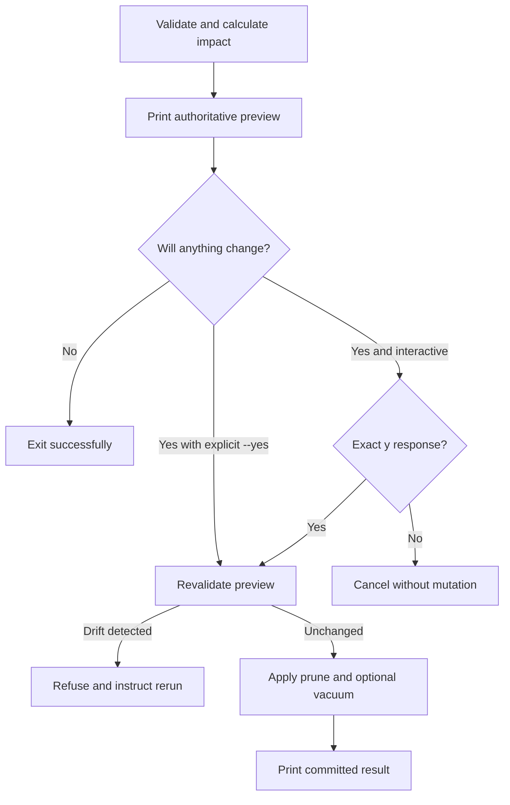

# Prune Impact Preview - Plan

## Goal Capsule

- **Objective:** Show the exact impact of an active-session prune before authorization and refuse mutation if that preview becomes stale.
- **Product authority:** This Product Contract defines preview, confirmation, and drift behavior; `AGENTS.md` defines repository safety and verification policy.
- **Execution profile:** Standard-depth Python change, implemented serially with test-first proof at the read-only planning, authorization, and writer-side revalidation boundaries.
- **Stop conditions:** Stop if implementation changes retention semantics, requires a writer lock while reading confirmation, cannot compare the preview against current state before deletion, or requires exposing session identifiers or content.
- **Tail ownership:** The implementing workflow owns focused and full tests, lint and compile checks, documentation synchronization, review, and one coherent child-repository commit.
- **Open blockers:** None.

## Product Contract

### Summary

`opencode-db prune` will preview how many sessions it will remove and retain, plus the oldest surviving session update time, before prompting or applying an explicit `--yes` request.
The confirmed operation remains bound to that preview and refuses without mutation if its selection changes.

### Problem Frame

The current confirmation asks for authorization without showing the expected effect of the selected retention policy.
An operator cannot verify the deletion count or resulting retention horizon before approving a potentially large prune.

### Key Decisions

- **Authoritative preview.** Confirmation authorizes the displayed selection, and any drift before mutation requires a rerun. (session-settled: user-directed — chosen over recomputing after confirmation or holding a writer lock during input: the operator should approve exactly the impact shown without blocking writers during human think time.)
- **Default impact summary.** Every preview reports sessions to remove, sessions to retain, and the oldest surviving session update time. (session-settled: user-directed — chosen over removal count alone or always-on size computation: these fields expose both deletion impact and the resulting retention horizon at low conceptual cost.)
- **Local timestamp.** The oldest surviving update time is rendered in local time with its UTC offset. (session-settled: user-directed — chosen over UTC-only or dual UTC-and-epoch output: the operator prefers local date interpretation.)
- **Preview remains visible with `--yes`.** Explicit automation bypasses only the prompt, not impact reporting. (session-settled: user-directed — chosen over prompt-only preview output: automated logs should retain the planned impact.)
- **No-op confirmation is conditional.** A zero-deletion request exits after preview without prompting unless `--vacuum` still requests physical compaction. (session-settled: user-directed — chosen over always prompting or always skipping confirmation: authorization is required only when an operation can still change the database.)
- **Size estimates bracket execution.** With `--estimate-size`, projected logical byte statistics appear in the preview and committed logical byte statistics remain in the result. (session-settled: user-directed — chosen over preview-only or result-only estimates: the operator can compare the expected and completed effect.)

The authorization flow has this shape:



### Requirements

**Impact preview**

- R1. Every valid prune request must print the number of sessions selected for removal and the number that would remain within the selected scope before authorization or mutation.
- R2. The preview must print the oldest surviving session's `time_updated` in local time with a UTC offset, or `none` when no session survives in the selected scope.
- R3. When `--project-id` is present, removal, retention, and oldest-survivor statistics must include only that exact project; otherwise they must cover the command's complete candidate scope.
- R4. Preview calculation and output must not render session titles, identifiers, transcript content, or a per-session deletion list.
- R5. With `--estimate-size`, the preview must include projected logical bytes removed and projected logical database bytes after pruning, while the committed result retains its existing logical estimate fields.

The canonical preview field order is:

```text
opencode-db: prune preview
sessions_to_prune: 772
sessions_to_keep: 18
oldest_surviving_session_updated: 2026-08-15T09:30:00-04:00
projected_logical_bytes_deleted: 12582912
projected_logical_database_bytes_after_prune: 4194304
```

The final two fields appear only with `--estimate-size`; `none` replaces the timestamp when no scoped session survives.

**Authorization and consistency**

- R6. Interactive confirmation must occur only after the complete impact preview is printed, and its prompt must identify every remaining mutation: `Prune matching sessions? [y/N]` for pruning alone, `Prune matching sessions and vacuum database? [y/N]` when both apply, or `Vacuum database? [y/N]` when compaction is the only remaining operation.
- R7. `--yes` must bypass only the prompt and must still print the same impact preview before mutation.
- R8. After authorization, the command must verify that the selected database state would produce the same removal set and preview statistics before changing any row.
- R9. Any drift between preview and application must refuse the operation with no mutation and instruct the operator to rerun the command.
- R10. The command must not hold a writer lock while waiting for interactive input.

**No-op and completion behavior**

- R11. When zero sessions are selected and `--vacuum` is absent, the command must print the preview, skip confirmation, make no database change, and exit successfully.
- R12. When zero sessions are selected and `--vacuum` is present, the preview must still precede authorization because physical compaction can change the database file.
- R13. Successful mutation must continue to print the committed prune result after the pre-operation preview.

### Key Flows

- F1. Interactive prune with selected sessions
  - **Trigger:** An operator runs a valid prune without `--yes`, and the selector matches one or more sessions.
  - **Steps:** The command calculates and prints the impact, waits for exact confirmation, revalidates the preview, and applies the unchanged selection.
  - **Outcome:** The committed result matches the authorized preview, or drift causes a no-change refusal.
  - **Covered by:** R1-R10, R13.
- F2. Explicit automated prune
  - **Trigger:** An operator or script runs a valid prune with `--yes`, and the selector matches one or more sessions.
  - **Steps:** The command prints the same impact preview, skips input, revalidates the preview, and applies the unchanged selection.
  - **Outcome:** Automation retains an auditable planned impact without weakening validation.
  - **Covered by:** R1-R10, R13.
- F3. No-op selection
  - **Trigger:** A valid selector chooses zero sessions.
  - **Steps:** The command prints the impact and checks whether `--vacuum` still requests a database change. When compaction remains, it obtains authorization, revalidates the preview, and vacuums only if the evidence is unchanged.
  - **Outcome:** It exits without prompting when no change remains, or requires authorization before compaction.
  - **Covered by:** R1-R13.

### Acceptance Examples

- AE1. **Covers R1-R4, R6, R8-R10, R13.** Given a project-scoped prune that would remove 772 sessions and retain 18, when the command reaches confirmation, then it first reports those counts and the local timestamp of the oldest surviving session; an exact `y` applies only that previewed selection.
- AE2. **Covers R2-R3.** Given a project-scoped prune that removes every session in that project while other projects retain sessions, when the preview is rendered, then the project retention count is zero and its oldest surviving session is `none`.
- AE3. **Covers R5.** Given `--estimate-size`, when a prune succeeds, then projected logical byte statistics appear before authorization and committed logical byte statistics appear after completion.
- AE4. **Covers R7-R10.** Given `--yes`, when the candidate selection changes after preview but before application, then the command prints the preview, reads no confirmation input, refuses the stale operation, and changes no row.
- AE5. **Covers R11.** Given zero selected sessions without `--vacuum`, when the preview completes, then the command exits successfully without prompting or mutating the database.
- AE6. **Covers R12.** Given zero selected sessions with `--vacuum`, when the preview completes, then interactive use still requires confirmation and detached use still requires `--yes` before compaction.

### Scope Boundaries

- A standalone dry-run mode is not included.
- Session titles, IDs, transcript content, and per-session deletion lists remain excluded from preview output.
- A quiet flag for suppressing preview output is deferred.
- The existing retention selectors and their selection semantics do not change.

### Dependencies and Assumptions

- The operator continues to arrange OpenCode shutdown and concurrent-use safety before pruning.
- Local time means the host timezone in effect when the preview is rendered, and the rendered value includes its UTC offset to avoid ambiguity.
- Logical size estimates retain their current payload-based meaning and do not claim physical file-size reduction.
- A zero-selection success is authoritative for the completed read snapshot, not a guarantee that another writer cannot add an eligible session after that snapshot and before process exit.

---

## Planning Contract

### Product Contract Preservation

The settled Product Contract is preserved; review added canonical output and mutation-specific prompt precision without changing its user-directed decisions.

### Key Technical Decisions

- **Introduce an immutable reviewed prune plan.** A read-only planning function captures the normalized selector, one resolved clock value, exact selected session IDs, displayed aggregates, and the logical-size evidence required for displayed projections. Fields containing session IDs are excluded from generated representations. The value authorizes no mutation; the CLI passes it to a separate application function only after confirmation. This extends the reviewed-plan pattern in `src/opencode_db/move.py:211-321` rather than holding the existing `BEGIN IMMEDIATE` transaction across terminal input. (session-settled: user-directed — chosen over recomputing after confirmation or holding a writer lock during input: the operator should approve exactly the impact shown without blocking writers during human think time.)
- **Share one selection evaluator across planning and application.** Existing candidate ordering and selector helpers in `src/opencode_db/prune.py:512-587` remain the sole retention-policy implementation. Planning resolves the wall-clock input once for time-based `--keep-newest`; application reuses that value so elapsed prompt time cannot cause artificial drift.
- **Compare only evidence that can affect the authorized operation.** Writer-side revalidation under `BEGIN IMMEDIATE` recomputes current candidates and must reproduce the selected IDs, removal and retention counts, oldest-survivor timestamp, and requested projected logical fields. It does not independently compare the complete candidate list or an undisplayed per-session size map. Project-scoped requests do not become stale because unrelated projects changed unless a displayed database-wide estimate also changed. Selection or displayed-statistic drift raises a stale-preview safety refusal before selection-table creation or deletion.
- **Keep preview rendering separate from committed outcomes.** The CLI renders the canonical preview block, flushes it successfully, then handles no-op, `--yes`, terminal checks, and exact `y` confirmation before invoking application. A preview write or flush failure refuses before writable application. The preview uses `sessions_to_prune`, `sessions_to_keep`, and `oldest_surviving_session_updated`; optional projected fields are distinct from the existing committed-result fields. Prompt copy identifies pruning, vacuum, or both. Successful no-op requests retain the existing zero-result output after the preview for output compatibility. (session-settled: user-directed — chosen over prompt-only preview output: automated logs should retain the planned impact.)
- **Render local time as bounded, timezone-aware ISO 8601.** Convert the surviving epoch-millisecond value through a timezone-aware local datetime and include its numeric UTC offset. Missing survivors render `none`; values that cannot be represented safely are malformed persisted data and fail closed instead of escaping a conversion exception. (session-settled: user-directed — chosen over UTC-only or dual UTC-and-epoch output: the operator prefers local date interpretation.)
- **Treat vacuum as a remaining mutation.** Zero selected sessions without `--vacuum` return from reviewed evidence without opening a writable connection. Zero selected sessions with `--vacuum` still pass through authorization, writer-side revalidation, and existing post-transaction compaction behavior. (session-settled: user-directed — chosen over always prompting or always skipping confirmation: authorization is required only when an operation can still change the database.)
- **Preserve the direct pruning API.** `prune_sessions` remains an immediate non-interactive domain entry point for current Python callers and tests, implemented through the same plan-and-apply path. Terminal authorization remains a CLI responsibility, while all mutation paths share freshness checks and transaction safety.
- **Bound read-only planning evidence.** Planning uses module-local limits matching the reviewed-move precedent: at most 250,000 scoped candidate sessions, 16 KiB per persisted session identifier, 64 MiB of captured candidate evidence, and ten seconds for SQLite scans and Python evidence construction. SQLite progress interruption and explicit loop checks enforce the monotonic deadline. Exceeding a count, byte, or time bound fails closed with a content-free operational diagnostic before preview or authorization; no new CLI option is introduced.
- **Bound the writable phase without expanding the CLI.** After the existing bounded writer-lock acquisition, application uses the same fixed ten-second transaction deadline and SQLite progress-handler pattern as `src/opencode_db/move.py:58-71` and `src/opencode_db/move.py:307-356`. Revalidation, deletion, integrity validation, and commit share that monotonic deadline; timeout or interruption confirms rollback before reporting a bounded operational failure. Vacuum remains the existing distinct post-commit operation.

### High-Level Technical Design

```mermaid
sequenceDiagram
  participant CLI
  participant Planner as Read-only planner
  participant DB as SQLite database
  participant Apply as Writable application
  CLI->>Planner: Build reviewed prune plan
  Planner->>DB: BEGIN read snapshot; validate and select
  DB-->>Planner: Candidates and optional size evidence
  Planner-->>CLI: Immutable preview and freshness evidence
  CLI->>CLI: Render preview and authorize if needed
  CLI->>Apply: Apply reviewed plan
  Apply->>DB: BEGIN IMMEDIATE; recompute evidence
  alt Evidence changed
    Apply-->>CLI: Stale-preview refusal; rollback
  else Evidence matches
    Apply->>DB: Delete selected state; validate; commit
    opt Vacuum requested
      Apply->>DB: VACUUM after commit or validated no-match
    end
    Apply-->>CLI: Committed prune outcome
  end
```

### Implementation Constraints

- Runtime code remains Python 3.11+ standard library only.
- Planning opens only the selected existing database through SQLite `mode=ro` and one explicit read transaction; it must not change main-database or WAL content, checkpoint, vacuum, change journal policy, or directly manage standard sidecars. SQLite may create or update its transient WAL-index SHM while reading committed WAL state.
- Planning and writer-side revalidation enforce the same scoped candidate-count, identifier-byte, and captured-evidence-byte limits so an accepted plan cannot cross a resource boundary only during application.
- Application opens the selected existing database through SQLite `mode=rw`, enables foreign keys, acquires its bounded writer lock, installs a fixed transaction deadline, revalidates before mutation, and preserves current rollback and post-commit vacuum failure reporting.
- Reviewed evidence may contain exact session IDs internally for comparison, but every such dataclass field uses `repr=False` and bounded exceptions, preview rendering, diagnostics, and logs remain content-free.
- All affected public classes and functions require synchronized documentation comments describing behavior, parameters, returns, failures, and side effects.
- Implementation stays in the existing prune and CLI boundaries; adjacent extraction of shared move/prune confirmation helpers is deferred unless required for correctness.

### Sequencing

1. Establish read-only planning and writer-side freshness comparison while preserving the existing direct `prune_sessions` contract.
2. Move CLI confirmation behind preview calculation and add conditional no-op behavior using the reviewed plan.
3. Synchronize public documentation and run focused, subsystem, and full verification after both layers are integrated.

### Risks and Mitigations

- **False drift from wall time:** Capture one `now_ms` during planning and reuse it during application for time-based retention.
- **Incomplete drift evidence:** Derive preview and comparison fields from one immutable evidence value and test each input dimension independently.
- **Large estimate cost before prompting:** Perform logical-size work only when required by `--target-size` or requested by `--estimate-size`, matching current behavior.
- **Oversized or slow planning input:** Cap scoped candidates, individual identifier bytes, and total captured evidence; interrupt SQLite and check Python loops against one fixed planning deadline; refuse with no previewed authorization when any bound is exceeded.
- **Unbounded writer work after lock acquisition:** Use one fixed monotonic transaction deadline, SQLite progress interruption, explicit boundary checks, and rollback-confirming cleanup across revalidation and mutation.
- **Buffered preview lost before automated mutation:** Flush the complete preview and refuse any write or flush failure before opening the writable application path.
- **Timezone-dependent tests:** Use a controlled Linux timezone with restoration, assert the numeric offset, and avoid relying on the developer machine's default zone.
- **Committed prune obscured by later vacuum failure:** Preserve the existing `PruneCommittedError` outcome and do-not-repeat diagnostic unchanged after the application split.

---

## Implementation Units

### U1. Reviewed prune planning and exact application

- **Goal:** Separate selection review from mutation while binding every authorized statistic to writer-side revalidation.
- **Requirements:** R1-R5, R8-R10, R11-R12; F1-F3; AE1-AE6.
- **Files:** `src/opencode_db/prune.py`, `tests/test_prune.py`.
- **Patterns:** Follow immutable reviewed evidence and read-only/writable phase separation in `src/opencode_db/move.py:211-321` and freshness comparison in `src/opencode_db/move.py:430-459`; retain selector ordering and policy helpers in `src/opencode_db/prune.py:512-587`.
- **Approach:** Add documented immutable request/evidence/preview values with ID-bearing fields suppressed from representations; factor current validation, candidate retrieval, logical-size calculation, and selection into one connection-scoped planner used in read-only planning and writer-side revalidation. Preserve one resolved clock value, compare selected IDs and authorized aggregate/projection evidence before creating the temporary selection table, then reuse the existing child deletion, integrity validation, commit, and vacuum path. Bound planning by candidate, identifier-byte, total-evidence-byte, and monotonic-time limits; bound transactional work with its own fixed monotonic deadline and SQLite progress handler. Keep `prune_sessions` as a plan-then-apply convenience entry point.
- **Test scenarios:**
  - A read-only plan produces exact removed and retained counts for count, time, and target-size selectors without changing main-database bytes, WAL bytes, committed rows, or journal policy; a committed-WAL fixture proves that planning observes WAL-only rows while allowing SQLite-managed SHM lifecycle changes.
  - Planning accepts evidence exactly at each documented candidate, identifier-byte, and total-evidence-byte bound, refuses the first value beyond each bound without exposing it, and applies the same caps during writer-side revalidation.
  - A deterministic planning timeout interrupts a long SQLite scan or Python evidence loop and reports a bounded operational failure without opening writable SQLite; cleanup removes its progress handler and closes the read transaction.
  - Project-scoped planning ignores other projects when calculating counts and oldest survivor; unscoped planning covers all candidates.
  - The oldest retained timestamp is the minimum `time_updated` among retained scoped candidates, and complete removal produces no survivor.
  - A time-based `--keep-newest` plan and application use the same captured clock even when wall time advances between phases.
  - `--target-size` recomputes from current logical sizes and binds the resulting exact selected IDs even when display estimates are not requested; changes to an undisplayed size map that preserve the selected IDs and displayed aggregates do not cause false drift.
  - `--estimate-size` computes projected deleted bytes and database-wide logical bytes after prune from the read snapshot, then the committed outcome agrees when evidence is unchanged.
  - Candidate insertion, deletion, timestamp change, project-scope change, target-size payload-size change, and displayed database-wide estimate change each cause a stale-preview refusal before mutation when relevant to the reviewed request.
  - Unrelated-project candidate drift does not invalidate a project-scoped preview without database-wide estimates, while it does invalidate a changed displayed database-wide estimate.
  - Stale refusal preserves every session and child row and leaves no temporary selection residue visible outside the rolled-back connection.
  - Known session IDs and content values never appear in reviewed-plan representations, bounded exceptions, or stale-refusal diagnostics.
  - A deterministic writer-phase timeout during revalidation, deletion, or integrity validation interrupts SQLite work, confirms rollback, and reports a bounded operational failure without partial row changes.
  - Zero selected sessions without vacuum can produce a successful zero outcome from reviewed evidence without writable open; zero selected sessions with vacuum still revalidates and compacts.
  - Pre-commit failures still roll back, and post-commit vacuum failure still carries the committed outcome and do-not-repeat warning.
- **Verification:** `python3 -m unittest -v tests.test_prune`; `python3 -m mypy src/opencode_db/prune.py`.
- **Dependencies:** None.

### U2. Preview-first CLI contract and operator documentation

- **Goal:** Render the reviewed impact before authorization in every mode and preserve safe terminal, no-op, result, and documentation behavior.
- **Requirements:** R1-R13; F1-F3; AE1-AE6.
- **Files:** `src/opencode_db/cli.py`, `tests/test_prune.py`, `tests/test_cli.py`, `README.md`, `docs/protocol.md`.
- **Patterns:** Follow `src/opencode_db/move_cli.py:150-205` for render-before-confirm orchestration while retaining prune's exact submitted-`y`, detached-stream, cancellation, and bounded error contracts in `src/opencode_db/cli.py:484-550`.
- **Approach:** Have the CLI build and render the reviewed plan before deciding whether authorization is needed. Render the canonical preview heading and field order with aggregate fields only; include projected logical fields under `--estimate-size`, then flush before any writable application. Return through the existing outcome renderer for a true no-op, select mutation-specific prompt copy, bypass only input under `--yes`, and pass authorized reviewed evidence to application. Update docs to replace the current claim that refusal happens before database opening with preview-first read-only behavior, snapshot-relative no-op semantics, and stale-preview refusal.
- **Test scenarios:**
  - Interactive output uses the canonical heading, labels, and order, places the complete preview before the prompt, identifies prune, vacuum, or both as applicable, and applies only after exact submitted lowercase `y`.
  - Cancellation, EOF, interruption, detached stdin, detached stdout, and `isatty` failure occur after preview but before writable application and preserve all rows.
  - `--yes` prints the identical preview, reads no input, and applies the reviewed plan.
  - Buffered preview output is flushed before `--yes` application; a deterministic preview write or flush failure returns an operational failure without opening writable SQLite or changing rows.
  - Zero selection without vacuum prints preview and the compatible zero result without probing terminal capability or opening writable SQLite.
  - Zero selection with vacuum still prompts interactively and requires `--yes` when detached.
  - Project-scoped output prints the project's retained horizon, including `none` when only other projects retain sessions.
  - Local timestamp output is deterministic under a controlled non-UTC timezone, includes a numeric offset, and malformed or out-of-range persisted milliseconds produce a bounded refusal.
  - Distinctive session IDs, titles, and transcript values do not appear in ordinary or `--estimate-size` previews, cancellation output, stale-refusal diagnostics, exception text, or per-session deletion lines.
  - `--estimate-size` prints projected fields before authorization and committed fields after success without exposing payload or session content.
  - A deterministic mutation inserted after preview causes an actionable stale-preview refusal and no prune output claiming success.
  - Help, README, and protocol assertions describe preview fields, no-op/vacuum authorization, `--yes`, and rerun-on-drift behavior consistently.
- **Verification:** `python3 -m unittest -v tests.test_prune tests.test_cli`; `python3 -m ruff check src tests`; `python3 -m compileall -q src tests`; `git diff --check`.
- **Dependencies:** U1.

---

## Verification Contract

| Gate | Command | Proves |
|---|---|---|
| Domain and CLI behavior | `python3 -m unittest -v tests.test_prune tests.test_cli` | Preview statistics, authorization ordering, drift refusal, no-op/vacuum behavior, estimates, and public docs |
| Full repository regression | `python3 -m unittest discover -s tests -v` | Existing cleanup, transfer, move, inspection, deployment, and prune behavior remains intact |
| Lint | `python3 -m ruff check src tests` | Changed Python remains free of configured lint violations |
| Compile | `python3 -m compileall -q src tests` | Source and tests compile under the active Python runtime |
| Focused typing | `python3 -m mypy src/opencode_db/prune.py` | New reviewed-plan values and domain boundaries type-check without relying on known unrelated full-project MyPy failures |
| Patch hygiene | `git diff --check` | No whitespace or conflict-marker defects remain |

Verification uses disposable fixtures beneath `/tmp/opencode-db-v1` and never reads or mutates live OpenCode state.

---

## Definition of Done

- Every R-ID and acceptance example is covered by U1 or U2 and a named test scenario.
- Preview output contains only aggregate counts, timestamps, and requested logical estimates; exact IDs remain internal evidence.
- No writer transaction or writable SQLite connection remains open while confirmation input is pending.
- The complete preview is flushed before writable application, and output failure refuses without mutation.
- Application refuses every relevant post-preview drift before deletion and preserves rows on refusal.
- Read-only planning and writer-side revalidation reject oversized or over-time evidence within documented fixed bounds.
- Writer-side revalidation and mutation are bounded by one fixed deadline with confirmed rollback on timeout or interruption.
- Existing selector semantics, direct `prune_sessions` behavior, committed result output, rollback behavior, and post-commit vacuum diagnostics remain compatible.
- README, protocol, CLI help, docstrings, and tests describe one consistent preview-first contract.
- All Verification Contract gates pass, except any explicitly documented pre-existing full-project type failures outside the focused gate.
- The final diff contains no abandoned helper, alternate implementation, temporary instrumentation, or generated test artifact from unsuccessful approaches.
